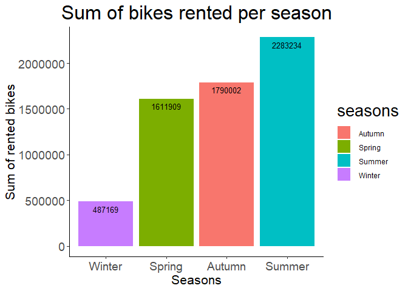
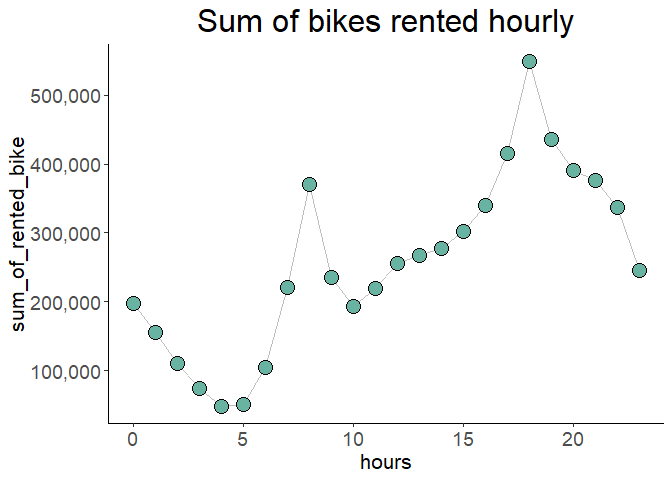
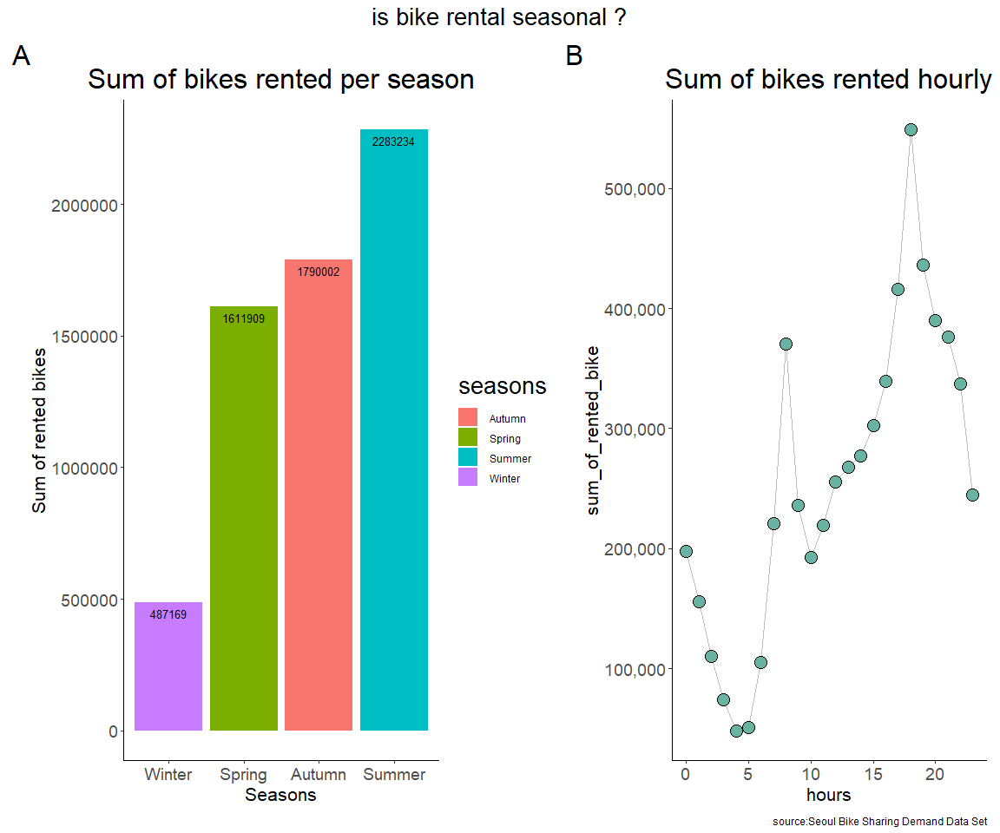
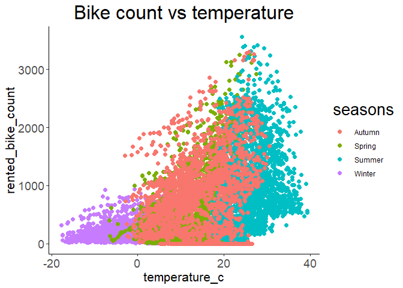
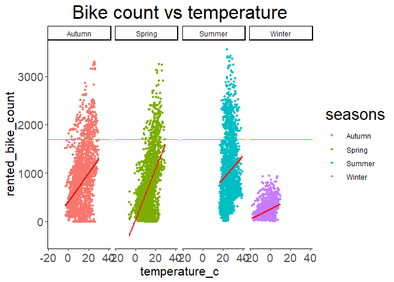

seoul bike rentals project
================
Emmanuel Omonogun
5/11/2022

## loading the data into R

``` r
Bike_rental <- read.csv("C:/Users/personal/Desktop/try excel project/testing/SeoulBikeData.csv")
```

## loading all necessary packages

``` r
library(tidyverse)
```

    ## Warning: package 'tidyverse' was built under R version 4.1.3

    ## -- Attaching packages --------------------------------------- tidyverse 1.3.1 --

    ## v ggplot2 3.3.5     v purrr   0.3.4
    ## v tibble  3.1.6     v dplyr   1.0.8
    ## v tidyr   1.2.0     v stringr 1.4.0
    ## v readr   2.1.2     v forcats 0.5.1

    ## -- Conflicts ------------------------------------------ tidyverse_conflicts() --
    ## x dplyr::filter() masks stats::filter()
    ## x dplyr::lag()    masks stats::lag()

``` r
library(skimr)
```

    ## Warning: package 'skimr' was built under R version 4.1.3

``` r
library(janitor)
```

    ## Warning: package 'janitor' was built under R version 4.1.3

    ## 
    ## Attaching package: 'janitor'

    ## The following objects are masked from 'package:stats':
    ## 
    ##     chisq.test, fisher.test

``` r
library(lubridate)
```

    ## 
    ## Attaching package: 'lubridate'

    ## The following objects are masked from 'package:base':
    ## 
    ##     date, intersect, setdiff, union

``` r
library(ggrepel)
```

    ## Warning: package 'ggrepel' was built under R version 4.1.3

``` r
library(ggpubr)
```

    ## Warning: package 'ggpubr' was built under R version 4.1.3

``` r
library(patchwork)
```

    ## Warning: package 'patchwork' was built under R version 4.1.3

``` r
library(ggtext)
```

    ## Warning: package 'ggtext' was built under R version 4.1.3

``` r
library(scales)
```

    ## 
    ## Attaching package: 'scales'

    ## The following object is masked from 'package:purrr':
    ## 
    ##     discard

    ## The following object is masked from 'package:readr':
    ## 
    ##     col_factor

## checking the structure of the data

``` r
View(Bike_rental)
Bike_rental %>% skim()
```

|                                                  |            |
|:-------------------------------------------------|:-----------|
| Name                                             | Piped data |
| Number of rows                                   | 8760       |
| Number of columns                                | 14         |
| \_\_\_\_\_\_\_\_\_\_\_\_\_\_\_\_\_\_\_\_\_\_\_   |            |
| Column type frequency:                           |            |
| character                                        | 4          |
| numeric                                          | 10         |
| \_\_\_\_\_\_\_\_\_\_\_\_\_\_\_\_\_\_\_\_\_\_\_\_ |            |
| Group variables                                  | None       |

Data summary

**Variable type: character**

| skim_variable   | n_missing | complete_rate | min | max | empty | n_unique | whitespace |
|:----------------|----------:|--------------:|----:|----:|------:|---------:|-----------:|
| Date            |         0 |             1 |  10 |  10 |     0 |      365 |          0 |
| Seasons         |         0 |             1 |   6 |   6 |     0 |        4 |          0 |
| Holiday         |         0 |             1 |   7 |  10 |     0 |        2 |          0 |
| Functioning.Day |         0 |             1 |   2 |   3 |     0 |        2 |          0 |

**Variable type: numeric**

| skim_variable             | n_missing | complete_rate |    mean |     sd |    p0 |    p25 |     p50 |     p75 |    p100 | hist  |
|:--------------------------|----------:|--------------:|--------:|-------:|------:|-------:|--------:|--------:|--------:|:------|
| Rented.Bike.Count         |         0 |             1 |  704.60 | 645.00 |   0.0 | 191.00 |  504.50 | 1065.25 | 3556.00 | ▇▃▂▁▁ |
| Hour                      |         0 |             1 |   11.50 |   6.92 |   0.0 |   5.75 |   11.50 |   17.25 |   23.00 | ▇▇▆▇▇ |
| Temperature..C.           |         0 |             1 |   12.88 |  11.94 | -17.8 |   3.50 |   13.70 |   22.50 |   39.40 | ▂▆▆▇▂ |
| Humidity…                 |         0 |             1 |   58.23 |  20.36 |   0.0 |  42.00 |   57.00 |   74.00 |   98.00 | ▁▅▇▇▅ |
| Wind.speed..m.s.          |         0 |             1 |    1.72 |   1.04 |   0.0 |   0.90 |    1.50 |    2.30 |    7.40 | ▇▇▂▁▁ |
| Visibility..10m.          |         0 |             1 | 1436.83 | 608.30 |  27.0 | 940.00 | 1698.00 | 2000.00 | 2000.00 | ▂▂▂▂▇ |
| Dew.point.temperature..C. |         0 |             1 |    4.07 |  13.06 | -30.6 |  -4.70 |    5.10 |   14.80 |   27.20 | ▂▃▇▇▆ |
| Solar.Radiation..MJ.m2.   |         0 |             1 |    0.57 |   0.87 |   0.0 |   0.00 |    0.01 |    0.93 |    3.52 | ▇▁▁▁▁ |
| Rainfall.mm.              |         0 |             1 |    0.15 |   1.13 |   0.0 |   0.00 |    0.00 |    0.00 |   35.00 | ▇▁▁▁▁ |
| Snowfall..cm.             |         0 |             1 |    0.08 |   0.44 |   0.0 |   0.00 |    0.00 |    0.00 |    8.80 | ▇▁▁▁▁ |

``` r
view(head(Bike_rental, 20))
view(tail(Bike_rental, 20))
str(Bike_rental)
```

    ## 'data.frame':    8760 obs. of  14 variables:
    ##  $ Date                     : chr  "01/12/2017" "01/12/2017" "01/12/2017" "01/12/2017" ...
    ##  $ Rented.Bike.Count        : int  254 204 173 107 78 100 181 460 930 490 ...
    ##  $ Hour                     : int  0 1 2 3 4 5 6 7 8 9 ...
    ##  $ Temperature..C.          : num  -5.2 -5.5 -6 -6.2 -6 -6.4 -6.6 -7.4 -7.6 -6.5 ...
    ##  $ Humidity...              : int  37 38 39 40 36 37 35 38 37 27 ...
    ##  $ Wind.speed..m.s.         : num  2.2 0.8 1 0.9 2.3 1.5 1.3 0.9 1.1 0.5 ...
    ##  $ Visibility..10m.         : int  2000 2000 2000 2000 2000 2000 2000 2000 2000 1928 ...
    ##  $ Dew.point.temperature..C.: num  -17.6 -17.6 -17.7 -17.6 -18.6 -18.7 -19.5 -19.3 -19.8 -22.4 ...
    ##  $ Solar.Radiation..MJ.m2.  : num  0 0 0 0 0 0 0 0 0.01 0.23 ...
    ##  $ Rainfall.mm.             : num  0 0 0 0 0 0 0 0 0 0 ...
    ##  $ Snowfall..cm.            : num  0 0 0 0 0 0 0 0 0 0 ...
    ##  $ Seasons                  : chr  "Winter" "Winter" "Winter" "Winter" ...
    ##  $ Holiday                  : chr  "No Holiday" "No Holiday" "No Holiday" "No Holiday" ...
    ##  $ Functioning.Day          : chr  "Yes" "Yes" "Yes" "Yes" ...

## checking for duplicate

``` r
Bike_rental[duplicated(Bike_rental),]
```

    ##  [1] Date                      Rented.Bike.Count        
    ##  [3] Hour                      Temperature..C.          
    ##  [5] Humidity...               Wind.speed..m.s.         
    ##  [7] Visibility..10m.          Dew.point.temperature..C.
    ##  [9] Solar.Radiation..MJ.m2.   Rainfall.mm.             
    ## [11] Snowfall..cm.             Seasons                  
    ## [13] Holiday                   Functioning.Day          
    ## <0 rows> (or 0-length row.names)

``` r
which(duplicated(Bike_rental))
```

    ## integer(0)

## checking for NA

``` r
colSums(is.na(Bike_rental))
```

    ##                      Date         Rented.Bike.Count                      Hour 
    ##                         0                         0                         0 
    ##           Temperature..C.               Humidity...          Wind.speed..m.s. 
    ##                         0                         0                         0 
    ##          Visibility..10m. Dew.point.temperature..C.   Solar.Radiation..MJ.m2. 
    ##                         0                         0                         0 
    ##              Rainfall.mm.             Snowfall..cm.                   Seasons 
    ##                         0                         0                         0 
    ##                   Holiday           Functioning.Day 
    ##                         0                         0

## i want the column names clean and properly structured

``` r
Bike_rental <- Bike_rental %>% 
  janitor::clean_names()

head(Bike_rental)
```

    ##         date rented_bike_count hour temperature_c humidity wind_speed_m_s
    ## 1 01/12/2017               254    0          -5.2       37            2.2
    ## 2 01/12/2017               204    1          -5.5       38            0.8
    ## 3 01/12/2017               173    2          -6.0       39            1.0
    ## 4 01/12/2017               107    3          -6.2       40            0.9
    ## 5 01/12/2017                78    4          -6.0       36            2.3
    ## 6 01/12/2017               100    5          -6.4       37            1.5
    ##   visibility_10m dew_point_temperature_c solar_radiation_mj_m2 rainfall_mm
    ## 1           2000                   -17.6                     0           0
    ## 2           2000                   -17.6                     0           0
    ## 3           2000                   -17.7                     0           0
    ## 4           2000                   -17.6                     0           0
    ## 5           2000                   -18.6                     0           0
    ## 6           2000                   -18.7                     0           0
    ##   snowfall_cm seasons    holiday functioning_day
    ## 1           0  Winter No Holiday             Yes
    ## 2           0  Winter No Holiday             Yes
    ## 3           0  Winter No Holiday             Yes
    ## 4           0  Winter No Holiday             Yes
    ## 5           0  Winter No Holiday             Yes
    ## 6           0  Winter No Holiday             Yes

## i want to properly format my date column to DATE format

``` r
class(Bike_rental$date)
```

    ## [1] "character"

``` r
Bike_rental$date <- as.Date(Bike_rental$date, "%d/%m/%y")

class(Bike_rental$date)
```

    ## [1] "Date"

## checking the unique value of our variable “season” and our date column

``` r
unique(Bike_rental$seasons)
```

    ## [1] "Winter" "Spring" "Summer" "Autumn"

``` r
unique(year(Bike_rental$date))
```

    ## [1] 2020

## to calculate the sum of bikes rented per season

``` r
team <- aggregate(x = Bike_rental$rented_bike_count,               
          by = list(Bike_rental$seasons),              
          FUN = sum) 
View(team)
```

``` r
colnames(team) <- c("seasons", "sum_of_rented_bike")

colnames(team)
```

    ## [1] "seasons"            "sum_of_rented_bike"

## plotting my first question “Is bike rental seasonal ?”

## 1A

``` r
A3 <-  ggplot(team, aes(x=reorder(seasons, sum_of_rented_bike), y = (sum_of_rented_bike), fill = seasons)) + geom_bar(stat="identity") + geom_text(aes(label=sum_of_rented_bike), vjust=1.6, color="black", size=3.5) + theme_classic() + labs(title = "Sum of bikes rented per season", x = "Seasons",
  y = "Sum of rented bikes") + theme(title = element_text(size = 20), axis.text = element_text(size =14 ), axis.title = element_text(size = 16),  plot.subtitle = element_text(size = 12, color = "gray30")) + theme(plot.title = element_text(hjust = 0.5))
```

``` r
plot(A3)
```

<!-- -->

## We can deduce from our graph that Summer in Seoul which is between June to August has the highest bike rental followed by Autumn which is from September to November, then Spring which is from Mid-March to end of May and lastly Winter which is from December to mid-March.

``` r
 team2 <- aggregate(x = Bike_rental$rented_bike_count,               
                     by = list(Bike_rental$hour),              
                     FUN = sum)
```

``` r
colnames(team2) <- c("hours", "sum_of_rented_bike")

colnames(team2)
```

    ## [1] "hours"              "sum_of_rented_bike"

``` r
View(team2)
```

## plotting my first question “Is bike rental seasonal ?”

## 1B

``` r
A4 <- ggplot(team2, aes(x = hours, y = sum_of_rented_bike)) + geom_line(color = "grey") + geom_point(shape = 21, color = "black", fill = "#69b3a2", size = 5) + theme_classic() + scale_y_continuous(labels = comma) + labs(title = "Sum of bikes rented hourly") + theme(plot.title = element_text(hjust = 0.5)) + theme(title = element_text(size = 20), axis.text = element_text(size =14 ), axis.title = element_text(size = 16))
```

``` r
plot(A4)
```

<!-- -->

## We can see one peak period in the morning around 8am and in the evening around 6pm which corresponds to the commuting times of workers and students

## using PATCHWORK to combine 1A and 1B

``` r
A3 + A4 + plot_annotation(title = "is bike rental seasonal ?", caption = "source:Seoul Bike Sharing Demand Data Set",  theme = theme(plot.title = element_text(size = 20)) , tag_levels = 'A') & 
  theme(plot.title = element_text(hjust = 0.5))
```

<!-- -->

## Answering question 2

``` r
min(Bike_rental$temperature_c)
```

    ## [1] -17.8

``` r
max(Bike_rental$temperature_c)
```

    ## [1] 39.4

## (2) How does temperature affect bike rental

## 1A

``` r
ggplot(Bike_rental, aes(x=temperature_c, y = rented_bike_count, color = seasons)) + geom_point(size = 2) +  theme_classic() + labs(x = "temperature_c", y = "rented_bike_count") + labs(title = "Bike count vs temperature", x = "temperature_c", y = "rented_bike_count") + theme(title = element_text(size = 20), axis.text = element_text(size =14 ), axis.title = element_text(size = 16),  plot.subtitle = element_text(size = 12, color = "gray30")) + theme(plot.title = element_text(hjust = 0.5)) 
```

<!-- -->

## From observation , there is a linear trend based on temperature. Higher temperature favors bike rental while low temperature reduced the numbers of bikes rented.

``` r
ggplot(Bike_rental, aes(x=temperature_c, y = rented_bike_count, color = seasons)) + geom_point(size = 1) +  theme_classic() + labs(x = "temperature_c", y = "rented_bike_count") + 
  geom_smooth(method = "lm", col = "red") + facet_grid(~seasons) +
  geom_hline(yintercept=1700, color = "green") + labs(title = "Bike count vs temperature", x = "temperature_c", y = "rented_bike_count") + theme(title = element_text(size = 20), axis.text = element_text(size =14 ), axis.title = element_text(size = 16),  plot.subtitle = element_text(size = 12, color = "gray30")) + theme(plot.title = element_text(hjust = 0.5))
```

    ## `geom_smooth()` using formula 'y ~ x'

<!-- -->

## An average line (the green line) was set at 1700 to show seasons with count of rented bikes above the given mark and A regression line(red line) to show trend in each season. From observation Autumn, Spring and Summer had counts above the set mark with Summer having the most of the three while Winter did not even meet the set mark. The linear line shows that increase in temperature positively affect bike rental.

## Inference Conclusion

## we have been able to answer our two questions using data driven approach.

## question 1 - “Is bike rental seasonal ?”.. The answer is yes. Workers and students rented bikes most in summer, followed by Autumn, then Winter and lastly Winter. Commuters that use bike as means of transportation do so in the morning around 8am in the morning and 6pm in the evening during the close of work.

## question 2 - How does temperature affect bike rental ?

## Increase in temperature increases the numbers of bike rented while decease in temperature decreases the numbers of rental.

## I will suggest that bikes and manpower should be at the peak in summer and during temperature between 15 degree celsius and 40 degree celsius.
